# Backend Architecture

Generated by /architecture-map on 2026-08-18 — traced from code, not docs.

Scope: all 6 `app/api/**/route.ts` handlers. No `trigger/*.ts` and no `vercel.json` exist in this repo — every entry point below is a plain HTTP route, there are no crons. Depth: 2-3 hops from each route into `lib/*`; trivial formatters/type-guards omitted.

```mermaid
flowchart TD
    subgraph PUBLIC["Public-facing routes"]
        SNAPSHOT["POST /api/audit/snapshot<br/>(public intake form)"]
        STATUS["GET /api/audit/[id]/status<br/>(polled by results page)"]
    end

    subgraph INTERNAL["Internal-only (x-internal-secret header)"]
        PROCESS["POST /api/audit/process<br/>trampoline: 202 immediately,<br/>runs pipeline in next.after()"]
    end

    subgraph ADMIN["Admin-token routes (x-admin-token header)"]
        ADMINLIST["GET /api/admin/audits<br/>(dashboard list, limit 200)"]
        LEADS["PATCH /api/leads/[id]<br/>(update lead_status/notes/follow_up)"]
    end

    subgraph WEBHOOK["Signed webhook"]
        CALENDLY["POST /api/webhooks/calendly<br/>(HMAC-SHA256 verified)"]
    end

    SNAPSHOT -->|"insert pending audit row"| SUPA[(Supabase: audits)]
    SNAPSHOT -->|"fetch, x-internal-secret,<br/>{auditId, intake}"| PROCESS

    PROCESS --> PIPELINE["runAuditPipeline()<br/>lib/pipeline/audit-pipeline.ts"]

    subgraph PIPE["Audit pipeline (Phase 1-3)"]
        direction TB
        PIPELINE --> SCRAPE["scrapeMultiplePages()<br/>lib/research/firecrawl.ts"]
        PIPELINE --> SIGNALS["gatherCompanySignals()<br/>lib/research/tavily.ts"]
        PIPELINE --> TRAFFIC["getDomainTraffic()<br/>lib/research/dataforseo.ts<br/>(.catch(null) — non-fatal)"]
        SCRAPE --> FIRECRAWL_EXT{{Firecrawl API}}
        SIGNALS --> TAVILY_EXT{{Tavily API}}
        TRAFFIC --> DFS_EXT{{DataForSEO API}}

        PIPELINE --> TECHDET["detectTechFromContent() /<br/>inferDepartmentsFromJobSignals() /<br/>extractManualProcessSignals()<br/>lib/research/tech-detector.ts<br/>(pure pattern matching, no external call)"]

        PIPELINE --> CLASSIFY["classifyBusiness()<br/>lib/ai/classify.ts"]
        CLASSIFY --> ANTHROPIC_EXT1{{Anthropic API<br/>structured JSON}}

        PIPELINE --> BENCH["getBenchmark()<br/>lib/benchmarks/industry-data.ts<br/>(static lookup table, no external call)"]

        PIPELINE --> SYNTH["synthesizeAudit()<br/>lib/ai/synthesize.ts"]
        SYNTH --> ANTHROPIC_EXT2{{Anthropic API<br/>sonnet-4-6, json_schema output}}
        SYNTH --> QSCORE["scoreAuditQualityLLM()<br/>(Promise.allSettled — never blocks)"]
        QSCORE --> ANTHROPIC_EXT3{{Anthropic API<br/>haiku-4-5}}

        PIPELINE --> SCOREENG["computeScores()<br/>lib/scoring/score-engine.ts<br/>(deterministic — overrides Claude's own<br/>scores in reportData, no external call)"]
    end

    PIPELINE -->|"update scores/opportunities/<br/>report_data/eval_quality"| SUPA

    PROCESS -->|"await runAuditPipeline(), then:"| POSTPIPE["post-pipeline fan-out<br/>(app/api/audit/process/route.ts)"]

    subgraph DELIVERY["Delivery + downstream (fire-and-forget except email)"]
        direction TB
        POSTPIPE --> SNAPEMAIL["sendSnapshotEmail()<br/>lib/email/resend.ts"]
        SNAPEMAIL --> SNAPPDF["generateSnapshotPDF()<br/>lib/pdf/snapshot-pdf.tsx"]
        SNAPEMAIL --> RESEND_EXT1{{Resend API}}

        POSTPIPE --> ADMINEMAIL["sendAdminNotification()<br/>lib/email/resend.ts"]
        ADMINEMAIL --> RESEND_EXT2{{Resend API}}

        POSTPIPE -.->|"fire-and-forget on the just-sent<br/>PDF buffer, observability only —<br/>never retries, never blocks delivery"| VQA["scoreVisualQuality()<br/>lib/pdf/visual-qa.ts"]
        VQA --> RASTER["rasterizePdf()<br/>pdfjs-dist + @napi-rs/canvas"]
        VQA --> ANTHROPIC_EXT4{{Anthropic API<br/>vision scoring}}
        VQA -.->|"update visual_qa_score/<br/>issues/verdict"| SUPA

        POSTPIPE -->|"insert lead row"| SUPA
        POSTPIPE -->|"update status=complete,<br/>lead_status=emailed"| SUPA

        POSTPIPE -.->|"fire-and-forget, silent-fail,<br/>never affects audit delivery"| PROPPIPE["runProposalPipeline()<br/>lib/proposal/proposal-pipeline.ts"]

        POSTPIPE -->|"upsert, onConflict: email,<br/>ignoreDuplicates: true"| SUPA
    end

    subgraph PROPOSAL["Auto-proposal pipeline"]
        direction TB
        PROPPIPE -->|"insert pending row"| SUPA
        PROPPIPE --> BUDGET["getMonthlySpend()<br/>query proposals.cost_usd<br/>MTD, cap=$25, alert@$22.50"]
        BUDGET -->|"cap reached"| SUPA
        BUDGET -.->|"≥90% of cap"| BUDGETALERT["sendBudgetAlert()"]
        BUDGETALERT --> RESEND_EXT3{{Resend API}}

        PROPPIPE --> DECOMP["decompressIntake()<br/>lib/ai/decompress-intake.ts"]
        DECOMP --> ANTHROPIC_EXT5{{Anthropic API<br/>haiku-4-5}}

        PROPPIPE --> INDRESEARCH["runIndustryResearch()<br/>lib/ai/industry-research.ts"]
        INDRESEARCH --> TAVILY_EXT2{{Tavily API}}
        INDRESEARCH --> ANTHROPIC_EXT6{{Anthropic API}}

        PROPPIPE --> GENPROP["generateProposalContent()<br/>lib/ai/generate-proposal.ts"]
        GENPROP --> ANTHROPIC_EXT7{{Anthropic API<br/>Opus 4.8}}

        PROPPIPE --> PROPPDF["generateProposalPDF()<br/>lib/pdf/proposal-pdf.ts"]

        PROPPIPE --> GMAILDRAFT["createGmailDraft()<br/>lib/gmail/create-draft.ts"]
        GMAILDRAFT --> GMAIL_EXT{{Gmail API<br/>OAuth2 refresh token}}

        PROPPIPE -->|"update status=generated,<br/>content, gmail_draft_id, cost_usd"| SUPA
        PROPPIPE -.->|"on failure: status=failed +"| RESENDFAIL["Resend admin-fail alert"]
        RESENDFAIL --> RESEND_EXT4{{Resend API}}
    end

    STATUS -->|"select id,status,scores,<br/>report_data by id"| SUPA
    ADMINLIST -->|"select * order by<br/>created_at desc limit 200"| SUPA
    LEADS -->|"update lead_status/notes/<br/>follow_up_at/outreach_added"| SUPA
    CALENDLY -->|"select latest complete audit<br/>by contact_email"| SUPA
    CALENDLY -->|"update lead_status=booked_call"| SUPA
    CALENDLY -.->|"on no-match/no-email/<br/>update failure"| SUPA

    classDef ext fill:#2d2d2d,stroke:#999,color:#fff,stroke-dasharray: 3 3
    classDef db fill:#1a3a5c,stroke:#4a90d9,color:#fff
    class ANTHROPIC_EXT1,ANTHROPIC_EXT2,ANTHROPIC_EXT3,ANTHROPIC_EXT4,ANTHROPIC_EXT5,ANTHROPIC_EXT6,ANTHROPIC_EXT7,FIRECRAWL_EXT,TAVILY_EXT,TAVILY_EXT2,DFS_EXT,RESEND_EXT1,RESEND_EXT2,RESEND_EXT3,RESEND_EXT4,GMAIL_EXT ext
    class SUPA db
```

## Quality-gate / retry loop — traced in detail

Two independent retry mechanisms sit inside `synthesizeAudit()` (`lib/ai/synthesize.ts`), and it's easy to conflate them:

- **Technical retry** (`runSynthesisWithRetry`, up to 3 attempts via `CONTENT_LIMITS`): fires only on `stop_reason === 'max_tokens'`, empty response text, or a JSON parse failure. Each retry shrinks the web/job content injected into the prompt (6000/3000 chars → 3600/1800 → 2000/1200 chars) to fit the response inside `max_tokens: 16000`. This is a content-size fix, not a content-quality fix.
- **Quality retry** (`synthesizeAudit`, `MAX_QUALITY_TURNS = 1`, so at most one retry / two total synthesis calls): fires when `checkAuditQuality()` — a set of **code-based**, non-LLM checks — fails: fewer than 3 opportunities, any workflow description under 40 chars, any opportunity missing a recommended tool, more than 1 opportunity with zero savings, zero total savings, or any banned enterprise tool (Salesforce Einstein, ServiceNow, etc.) named. On failure, `buildQualityFeedback()` appends the specific failed checks to the next prompt and forces `jsonOnly = true`. The retry re-runs the full technical-retry-wrapped call again — so a quality-gate failure can trigger up to 3 more Anthropic calls (its own technical retries), not just 1.
- Whatever comes out of turn 2 is returned unconditionally — **the pipeline never throws on a quality failure**, it just logs the outstanding issues and ships the best available result. `preRetryIssues` and `qualityRetryUsed` are threaded back into `audit-pipeline.ts` and stored in `eval_quality` for observability.
- Separately, `scoreAuditQualityLLM()` (Haiku, 1-5 score) runs via `Promise.allSettled` in parallel with `checkAuditQuality()` back in `audit-pipeline.ts` — it is purely observational (stored in `eval_quality.llm_score`), it does **not** feed the retry decision at all. Only the code-based `checkAuditQuality()` gate drives the retry.

## Mismatches found

- None found against docs/comments — this repo has no prior `docs/architecture.md` or other architecture doc to compare against, and inline comments in the traced files (e.g. the `/api/audit/process` trampoline comment, the visual-QA "fire and forget" comment, the proposal pipeline "silent fail" comment) accurately describe what the code does.
- One clarification worth flagging explicitly: `scoreAuditQualityLLM` (LLM-judged 1-5 score) and `checkAuditQuality` (code-based pass/fail gate) sound like they could be the same mechanism from the function names alone — they are not. Only `checkAuditQuality` drives the retry; the LLM score is stored for review but never read by the retry logic.

## Deliberately out of scope

- `lib/pdf/snapshot-pdf.tsx` and `lib/pdf/proposal-pdf.ts` internals (React-PDF rendering — no further external calls beyond what's already shown).
- `lib/benchmarks/industry-data.ts` (static lookup table, no calls of any kind).
- Supabase client construction (`lib/supabase.ts`) — every `SUPA` node above represents a real `getSupabase().from(...)` call traced from the citing file, not a placeholder.
